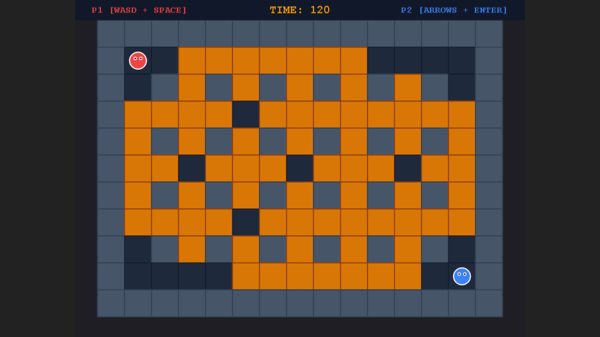

# Bubble Battle: Campus Chaos

## 1. Giới thiệu Game
**Bubble Battle: Campus Chaos** là trò chơi 2D đối kháng hai người chơi cục bộ (Local 2-Player) lấy cảm hứng từ cơ chế đặt bóng nước cổ điển (Bomberman / Boom Online). Trò chơi được phát triển bằng HTML5, JavaScript nâng cao (ES6+), engine Phaser 3 và công cụ đóng gói Vite.

---

## 2. Ảnh chụp MenuScene


---

## 3. Ảnh chụp Gameplay


---

## 4. Luật chơi
- Hai người chơi xuất phát ở hai góc đối diện trên bản đồ dạng lưới 11x15.
- Mỗi người chơi có thể di chuyển và đặt bóng nước dưới chân.
- Bóng nước tự động nổ sau 2 giây (`balloonFuseDuration`).
- Tia nước phát tán theo 4 hướng (`UP`, `DOWN`, `LEFT`, `RIGHT`) với bán kính mặc định 1 ô.
- Tia nước bị chặn lại bởi Tường cứng (`WALL`) và phá hủy Thùng gỗ (`CRATE`) đầu tiên va chạm.
- Người chơi chạm phải tia nước sẽ chuyển sang trạng thái bị dính nước (`TRAPPED`) trong 3 giây trước khi hạ gục (`DEAD`).
- Khi đã TRAPPED, hit tiếp theo không khiến người chơi chết ngay. Người chơi chuyển sang DEAD khi trap timer kết thúc.
- Người chơi còn sống cuối cùng sẽ giành chiến thắng.
- Trận đấu hết thời gian (120 giây) hoặc cả hai người chơi cùng bị hạ gục sẽ có kết quả Hòa (`DRAW`).

---

## 5. Phím điều khiển
### Player 1 (Màu Đỏ - Red)
- **Lên / Xuống / Trái / Phải:** `W` / `S` / `A` / `D`
- **Đặt bóng nước:** `SPACE`

### Player 2 (Màu Xanh - Blue)
- **Lên / Xuống / Trái / Phải:** Phím mũi tên (`UP` / `DOWN` / `LEFT` / `RIGHT`)
- **Đặt bóng nước:** `ENTER`

### Quiz Answer Controls
- **Chọn đáp án 1:** Phím `1`
- **Chọn đáp án 2:** Phím `2`
- **Chọn đáp án 3:** Phím `3`
- **Chọn đáp án 4:** Phím `4`

---

## 6. Công nghệ sử dụng
- **Core:** JavaScript (ES6+), HTML5 Canvas, CSS3
- **Engine:** Phaser 3 (Arcade Physics Engine, Scale Manager)
- **Bundler:** Vite 6.x
- **Unit Testing:** Vitest
- **E2E / Integration Testing:** Playwright (Headless Chromium)

---

## 7. Educational JavaScript Quiz System
Khi người chơi phá hủy thùng gỗ (`CRATE`), có cơ hội xuất hiện một **Quiz Item** (hình hộp dấu `?` vàng) tại vị trí thùng vừa phá. Khi người chơi chạm vào Quiz Item, GameScene sẽ tạm dừng và mở bảng câu hỏi JavaScript.

### Cách trả lời
- Câu hỏi hiển thị 4 đáp án đánh số `1`–`4`.
- Người chơi nhấn phím `1`, `2`, `3`, hoặc `4` để chọn.
- Thời gian giới hạn: **10 giây**.
- Trong lúc trả lời, game tạm dừng hoàn toàn — người chơi không thể di chuyển, đặt bóng, hoặc bị sát thương.

### Phần thưởng (Power-up)
- **Speed Boost:** Tăng tốc độ di chuyển thêm 20%, hiệu lực 10 giây.
- **Extra Balloon:** Tăng giới hạn bóng tối đa thêm 1 (tối đa 3), hiệu lực đến hết round.
- **Explosion Range:** Tăng bán kính nổ thêm 1 ô (tối đa 3), hiệu lực đến hết round.

### Chủ đề câu hỏi
- Kiểu dữ liệu và `typeof`
- Toán tử tăng/giảm
- So sánh `==` vs `===`
- Phương thức mảng (`push`, `pop`)
- Khai báo biến (`var`, `let`, `const`)
- Vòng lặp (`for...of`)
- Kiểm tra kiểu (`Array.isArray`)
- Hàm và giá trị trả về
- JSON (`JSON.stringify`)

### Quy tắc Quiz
- Chỉ cho phép **tối đa 1 Quiz Item** trên bản đồ tại một thời điểm.
- Câu hỏi không bị lặp lại liên tiếp.
- Trả lời đúng: nhận power-up và +1 điểm JS.
- Trả lời sai hoặc hết giờ: không nhận thưởng.
- Sau khi trả lời, game tiếp tục bình thường.

---

## 8. Kiến thức JavaScript Nâng cao Áp dụng
1. **ES6 Classes & Inheritance:** Sử dụng `class extends Phaser.Scene` và `class extends Phaser.Physics.Arcade.Sprite` cho nhân vật và vật thể.
2. **ES Modules (`import` / `export`):** Phân chia kiến trúc dự án thành các module độc lập.
3. **Event Emitter:** Giao tiếp loose-coupling giữa các thành phần (`request_place_balloon`, `balloon_explode`, `player_dead`, `timer_tick`, `crate_destroyed`, `quiz_item_collected`, `quiz_answered`, `power_up_granted`).
4. **Finite State Machine (FSM):** Quản lý vòng đời trạng thái nhân vật (`ACTIVE` -> `TRAPPED` -> `DEAD`) và vòng đấu (`READY` -> `PLAYING` -> `PAUSED` -> `FINISHED`).
5. **Mảng hai chiều (2D Array Matrix):** Biểu diễn bản đồ trò chơi bằng ma trận số nguyên.
6. **Pure Functions:** Hàm thuần toán học chuyển đổi tọa độ `gridToWorld` / `worldToGrid`, resolver `resolvePlayerStates`, quiz utils (`selectRandomQuestion`, `isCorrectAnswer`, `validateQuestionBank`).
7. **Timers & Delayed Calls:** Cài đặt bộ đếm ngược nổ bóng (`fuseTimer`), bộ đếm thời gian bẫy (`trapTimer`), đồng hồ trận đấu (`roundTimer`), đồng hồ quiz (`quizTimer`), speed boost timer.
8. **Automated Testing:** Kiểm thử đơn vị tự động với Vitest và kiểm thử tích hợp giao diện trình duyệt với Playwright.

---

## 9. Cấu trúc thư mục
```text
├── docs/
│   ├── PRESENTATION_GUIDE.md   # Tài liệu hướng dẫn thuyết trình ASM
│   ├── SUBMISSION_CHECKLIST.md # Checklist nộp bài
│   ├── TEST_REPORT.md         # Báo cáo kiểm thử tự động
│   └── screenshots/           # Ảnh chụp giao diện trò chơi
├── scripts/
│   └── verify-browser.js      # Integration test script bằng Playwright
├── src/
│   ├── constants/             # Khai báo Hằng số Luật chơi và Trạng thái
│   ├── data/                  # Dữ liệu ma trận bản đồ (level01.js) và câu hỏi JS (jsQuestions.js)
│   ├── entities/              # Lớp đại diện Player.js, WaterBalloon.js, QuizItem.js
│   ├── scenes/                # Các màn chơi (Boot, Menu, Game, Quiz, Result)
│   ├── styles/                # Stylesheet CSS
│   ├── systems/               # Logic GridMap, Explosion và RoundManager
│   ├── utils/                 # Utility pure functions (grid, roundResolver, quiz)
│   ├── config.js              # Cấu hình Phaser Game Engine & Scale Manager
│   └── main.js                # File khởi tạo ứng dụng
├── tests/                     # Unit test suite (roundResolver.test.js, quiz.test.js)
├── index.html                 # Trang HTML chính chứa Canvas
├── package.json               # Quản lý dependencies và scripts
└── vite.config.js             # Cấu hình bundler Vite
```

---

## 10. Hướng dẫn cài đặt & Chạy ứng dụng
1. **Clone repository:**
   ```bash
   git clone https://github.com/hieungrx/Bubble-Battle.git
   cd Bubble-Battle
   git checkout feature/bubble-battle-asm
   ```
2. **Cài đặt dependencies:**
   ```bash
   npm install
   ```
3. **Chạy môi trường Development:**
   ```bash
   npm run dev
   ```
   Mở trình duyệt truy cập: `http://localhost:5173`

4. **Đóng gói sản phẩm (Build Production):**
   ```bash
   npm run build
   ```

---

## 11. Hướng dẫn chạy QA Test Automation
Dự án được tích hợp pipeline kiểm thử tự động toàn diện:
```bash
npx playwright install chromium
npm run qa
```
Lệnh `npm run qa` sẽ tự động thực thi chuỗi lệnh:
1. `npm run test` (Chạy 6/6 Unit test case phân định thắng thua bằng Vitest).
2. `npm run build` (Build kiểm tra lỗi biên dịch TypeScript/JS bundle).
3. `npm run test:browser` (Khởi chạy Headless Chromium Playwright kiểm tra trực tiếp di chuyển, đặt bóng, va chạm vật lý và lặp restart scene 3 lần).

---

## 12. Giới hạn phiên bản (Scope Constraints)
- Trò chơi hỗ trợ 2 người chơi cục bộ trên cùng bàn phím (Local 2-Player). Không hỗ trợ Multiplayer Online hay AI Bot.
- Bản đồ cố định Level 01 theo đúng phạm vi thiết kế ban đầu.
- Trò chơi tập trung tối đa vào tính chính xác của cơ chế vật lý, va chạm và quản lý trạng thái.

---

## 13. Nguồn asset và giấy phép
- Mọi hình ảnh hiển thị trong game (Nhân vật, Tường, Thùng, Bóng nước, Tia nổ) đều được dựng động thông qua **Phaser Graphics API** ngay trong code, hoàn toàn không sử dụng hình ảnh bên ngoài có bản quyền.
- Mã nguồn thuộc sở hữu đồ án môn học JavaScript Nâng cao.
